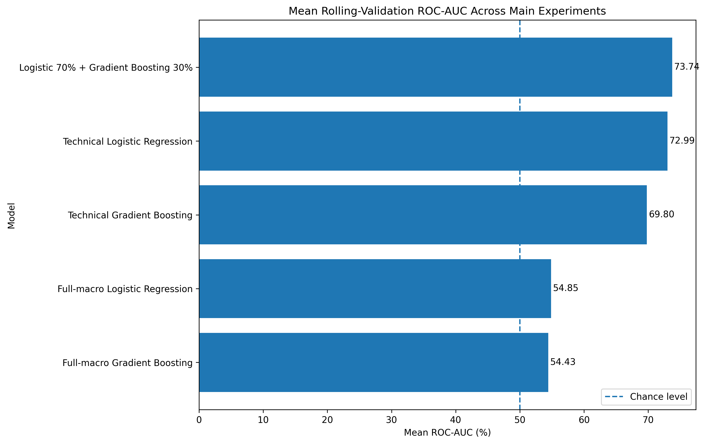
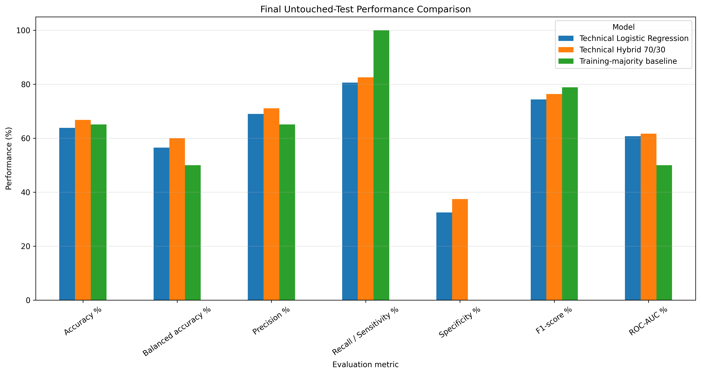
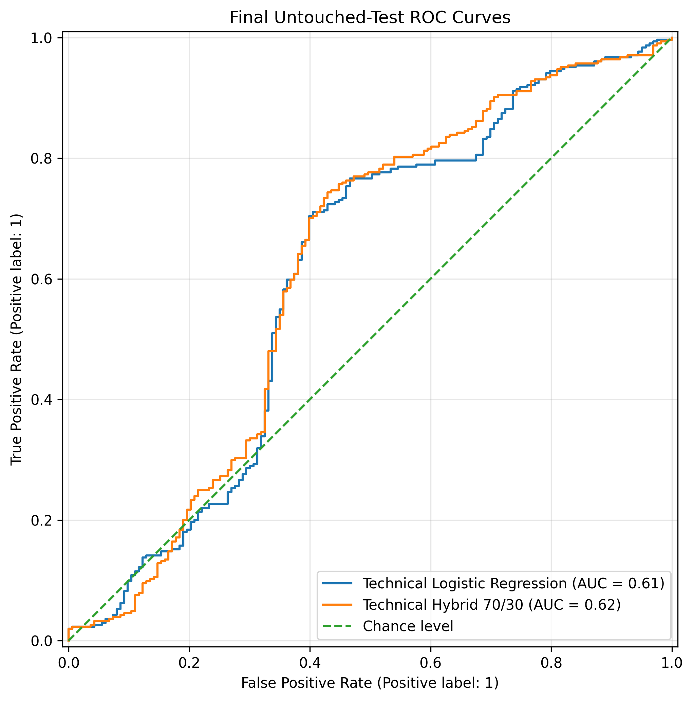
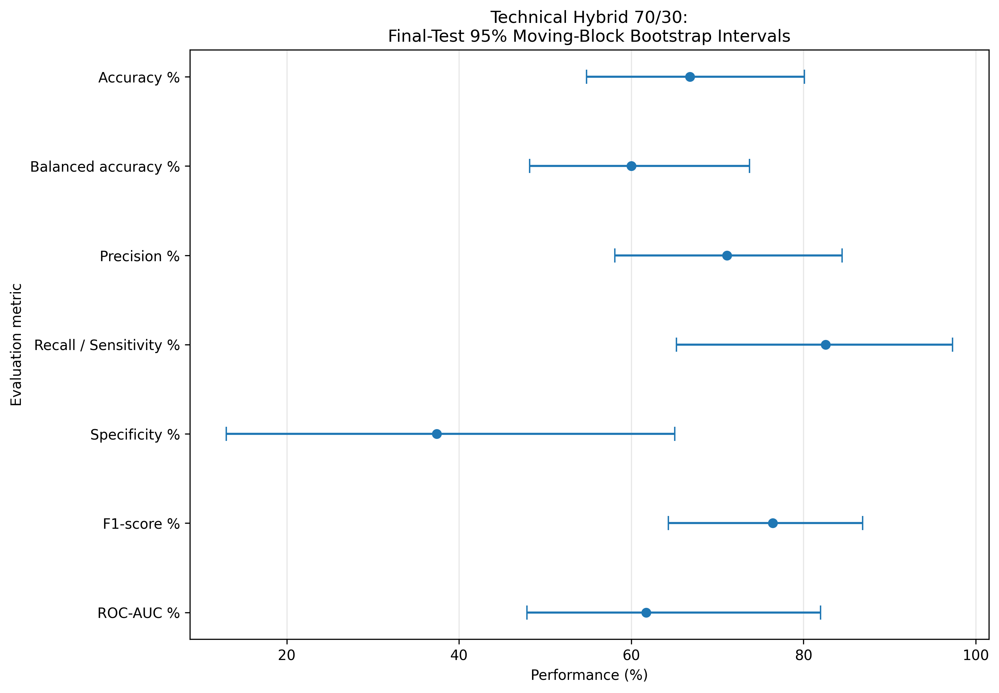
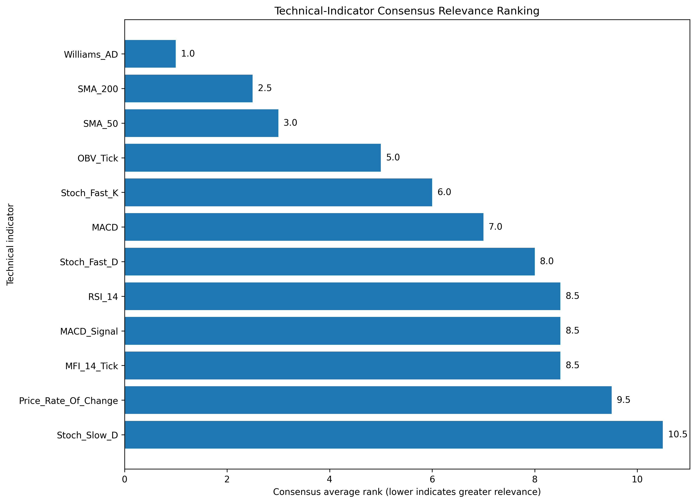

# Gold Trend Forecasting using Hybrid Machine Learning

> **Live Research Prototype:** Explore the deployed forecasting dashboard and generate 20-trading-day XAU/USD trend predictions using the 12 technical indicators.

A hybrid machine learning framework for forecasting the **20-trading-day trend direction of XAU/USD (Gold)** using technical market indicators and time-series-aware validation.

This project was developed as part of my **MSc in Computer Science** research at the University of Nairobi.

## Project Overview

Gold prices are influenced by complex interactions between market momentum, trend behaviour, investor activity, and macroeconomic conditions.

This research investigates whether machine learning can reliably classify the medium-term direction of gold as either:

- **Uptrend**
- **Downtrend**

The final system uses a hybrid ensemble combining **Logistic Regression** and **Gradient Boosting**.

## Final Model

The final hybrid model combines:

- **70% Logistic Regression**
- **30% Gradient Boosting**

The weighting was selected based on validation performance using time-series-aware evaluation.

## Technical Indicators

The final locked model uses 12 technical features:

1. RSI (14)
2. Stochastic Fast %K
3. Stochastic Fast %D
4. Stochastic Slow %D
5. MACD
6. MACD Signal
7. Price Rate of Change
8. On-Balance Volume (OBV)
9. 50-period Simple Moving Average
10. 200-period Simple Moving Average
11. Money Flow Index (14)
12. Williams Accumulation/Distribution

## Dataset

The technical dataset contains:

- **3,108 observations**
- Period: **2012-08-09 to 2024-12-02**
- Target: **20-trading-day gold trend direction**
- Uptrend observations: **1,590**
- Downtrend observations: **1,518**

Macroeconomic variables were also evaluated, including:

- Effective Federal Funds Rate
- 10-Year US Treasury Yield
- Broad US Dollar Index

The macroeconomic features did not consistently improve validation performance at the 20-trading-day horizon and were therefore not retained in the final model.

## Validation Strategy

Because financial data is time dependent, conventional random train-test splitting was avoided.

The project uses:

- Expanding-window validation
- Four validation folds
- 20-observation purge gap
- Locked model weights and thresholds
- Final untouched test period

This approach reduces the risk of look-ahead bias and data leakage.

## Final Test Performance

| Metric | Score |
|---|---:|
| Accuracy | 66.81% |
| Balanced Accuracy | 60.00% |
| Precision | 71.11% |
| Recall | 82.57% |
| F1 Score | 76.41% |
| ROC-AUC | 61.71% |

## Key Results

### Model Selection

The hybrid model achieved the strongest mean rolling-validation ROC-AUC among the main technical modelling experiments. The final ensemble combines **70% Logistic Regression and 30% Gradient Boosting**.

### Final Untouched-Test Performance

The locked model was evaluated on a final chronological test period that was not used during model selection, threshold selection, or hyperparameter tuning.

### ROC Analysis

The final hybrid model achieved a test ROC-AUC of approximately **0.62**, slightly outperforming the standalone Logistic Regression model.

### Performance Uncertainty

Moving-block bootstrap confidence intervals were used to quantify uncertainty while preserving temporal dependence in the financial time series.

### Technical Indicator Relevance

A consensus ranking was used to examine the relative relevance of the technical indicators across the modelling framework.

## Prototype

An interactive prototype was developed to allow users to enter the latest technical indicator values and receive:

- Predicted 20-day trend direction
- Uptrend or Downtrend classification
- Probability score
- Model information
- Supporting technical indicator values

The prototype was developed using StreamLit.

## Technologies

`Python` `Pandas` `NumPy` `Scikit-learn` `Gradient Boosting`  
`Logistic Regression` `SHAP` `StreamLit` `Matplotlib`

## Research Contribution

The project demonstrates a reproducible framework for medium-term gold trend classification using a hybrid machine learning approach.

Key contributions include:

- Hybridisation of linear and non-linear machine learning models
- Time-series-aware validation with leakage controls
- Evaluation of both technical and macroeconomic predictors
- Model interpretability
- Development of an interactive forecasting prototype

## Repository Structure

The repository will contain the research notebooks, trained model components, visualisations, prototype code, and supporting documentation.

## Author

**Oscar Muchiri**  
MSc Computer Science  
BSc Geospatial Engineering  

GitHub: [OscarMuchiri](https://github.com/OscarMuchiri)

---

> This project is intended for research and educational purposes and should not be interpreted as financial advice.
